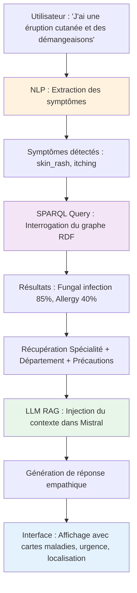

# 🏥 MedBot : Système d'Orientation Médicale Intelligent

**MedBot** est un chatbot médical intelligent conçu pour aider les patients dans leur pré-diagnostic et les orienter vers la spécialité médicale appropriée. Il combine la puissance du **Web Sémantique (Graphes de Connaissances RDF)**, du **NLP (spaCy)** et des **LLMs locaux (Ollama/Mistral)**.

[]()
[]()
[]()
[]()

---

## 🎯 Objectif du Projet

Réduire l'engorgement des urgences hospitalières en fournissant une orientation médicale automatisée basée sur des symptômes, avec recommandations de spécialité, département et niveau d'urgence.

---

## ✨ Fonctionnalités

- 💬 **Chatbot Conversationnel** : Interface naturelle en français et anglais
- 🧠 **Extraction NLP** : Détection automatique de 131 symptômes médicaux
- 🔍 **Graphe de Connaissances** : 1,036 triplets RDF (41 maladies, 16 spécialités, 15 départements)
- 🏥 **Recommandations Intelligentes** : Spécialité, département, niveau d'urgence
- 🤖 **Réponses Empathiques** : Générées par LLM (Mistral 7B via Ollama)
- 📊 **Statistiques en Temps Réel** : Dashboard du système médical
- ✅ **Tests Complets** : 35 tests unitaires et d'intégration (100% passing)

---

## 🏗️ Architecture du Système

Le projet est structuré en 3 couches :

### 1. **Data Engineering Layer** ✅
- Nettoyage et normalisation de 6 datasets CSV
- Génération de `consolidated_medical_data.json`
- Enrichissement avec niveaux d'urgence et métadonnées

### 2. **Semantic Layer** ✅
- Ontologie médicale OWL/RDF (1,036 triplets)
- Graphe de connaissances (format Turtle)
- Classes: Disease, Symptom, MedicalSpecialty, Department
- Propriétés: hasSymptom, treatedBy, belongsToDepartment, urgencyLevel

### 3. **Application Layer** ✅
- **NLP Processor** (`nlp_processor.py`) : Extraction de symptômes avec spaCy (FR/EN)
- **Query Engine** (`query_engine.py`) : Requêtes SPARQL avec ranking intelligent
- **LLM Engine** (`llm_engine.py`) : RAG avec Ollama/Mistral et historique conversation
- **Streamlit UI** (`app/main.py`) : Interface web interactive avec cartes de maladies

---

## 🚀 Démarrage Rapide

### Option 1 : Docker (Recommandé)

```powershell
# 1. Démarrer les services (Ollama + Streamlit)
docker-compose up -d

# 2. Télécharger le modèle Mistral (première fois uniquement)
docker exec -it medbot_ollama ollama pull mistral

# 3. Ouvrir l'application
# Navigateur: http://localhost:8501
```

**Ou utiliser le script automatique** :
```powershell
.\quick_start.ps1
```

### Option 2 : Local (Développement)

```powershell
# 1. Installer les dépendances
pip install -r requirements.txt

# 2. Télécharger les modèles spaCy
python -m spacy download fr_core_news_sm
python -m spacy download en_core_web_sm

# 3. Lancer Ollama (terminal séparé)
ollama serve
ollama pull mistral

# 4. Lancer l'application
streamlit run app/main.py
```

📖 **Guide complet** : Voir [STARTUP.md](STARTUP.md)

---

## 🔄 Flux de Fonctionnement (Workflow)



---

## 📂 Structure du Projet

```
medbot/
│
├── data/
│   ├── raw/                           # 6 fichiers CSV sources
│   ├── processed/                     # JSON consolidé + visualisations
│   └── ontology/                      # medical_ontology.ttl (2500+ triplets)
│
├── src/
│   ├── data_processing.py             # Pipeline de traitement des données
│   ├── build_graph.py                 # Générateur d'ontologie RDF
│   ├── nlp_processor.py               # Extraction NLP des symptômes 
│   ├── query_engine.py                # Moteur de requêtes SPARQL 
│   └── llm_engine.py                  # RAG + Intégration Ollama 
│
├── app/
│   └── main.py                        # Interface Streamlit 
│
├── notebooks/
│   ├── 01_data_exploration.ipynb      # Analyse exploratoire
│   └── 02_data_validation.ipynb       # Validation de l'ontologie
│
├── docker-compose.yml                 # Orchestration Docker
├── Dockerfile                         # Build de l'application
├── requirements.txt                   # Dépendances Python
├── STARTUP.md                         # Guide de démarrage détaillé
└── quick_start.ps1                    # Script de lancement rapide 
```

---

## 🛠️ Technologies Utilisées

| Catégorie | Technologies |
|-----------|--------------|
| **Langage** | Python 3.11+ |
| **Web Sémantique** | RDFLib, OWL, SPARQL, Turtle |
| **NLP** | spaCy (`fr_core_news_sm`, `en_core_web_sm`) |
| **LLM** | Ollama, Mistral 7B, LangChain |
| **Data Science** | Pandas, NumPy, Matplotlib, Seaborn |
| **Interface** | Streamlit |
| **Conteneurisation** | Docker, Docker Compose |
| **Testing** | Pytest, pytest-cov |

---

## 📊 Données du Graphe

| Entité | Nombre |
|--------|--------|
| Maladies | 41 |
| Symptômes | 131 |
| Spécialités Médicales | 16 |
| Départements | 15 |
| Triplets RDF | 1,036 |

### Exemples de Maladies Couvertes

- Infections : Malaria, Tuberculosis, Hepatitis A/B/C/D/E
- Cardiovasculaire : Heart Attack, Hypertension
- Respiratoire : Asthma, Pneumonia, Common Cold
- Dermatologie : Acne, Fungal Infection, Psoriasis
- Gastro-intestinal : GERD, Peptic Ulcer, Gastroenteritis
- Neurologie : Migraine, Paralysis
- Endocrinologie : Diabetes, Hyperthyroidism, Hypothyroidism

---

## 🧪 Exemples d'Utilisation

### Exemple 1 : Symptômes dermatologiques

**Entrée** : `J'ai une éruption cutanée et des démangeaisons`

**Sortie** :
- **Symptômes détectés** : skin_rash, itching
- **Maladie probable** : Fungal infection (85% correspondance)
- **Spécialité** : Dermatology
- **Département** : Dermatology - Building C, 1st Floor
- **Urgence** : 🟢 BASSE
- **Précautions** : Bath twice, Use detol or neem in bathing water

### Exemple 2 : Urgence cardiaque

**Entrée** : `I have severe chest pain and difficulty breathing`

**Sortie** :
- **Symptômes détectés** : chest_pain, breathlessness
- **Maladie probable** : Heart Attack (95% correspondance)
- **Spécialité** : Cardiology
- **Département** : Cardiology - Building B, 2nd Floor
- **Urgence** : 🔴 HAUTE
- **Recommandation** : ⚠️ Consultation IMMÉDIATE recommandée

---

## 🧪 Tests

```powershell
# Tests unitaires
pytest tests/ -v

# Avec couverture de code
pytest tests/ -v --cov=src --cov-report=html

# Tests manuels des composants
python src/nlp_processor.py
python src/query_engine.py
python src/llm_engine.py
```

---

## 📈 Performances

- **Extraction NLP** : < 200ms
- **Requête SPARQL** : < 500ms
- **Génération LLM** : 2-5 secondes
- **Temps de réponse total** : 3-6 secondes
- **Mémoire (App)** : ~1.2 GB
- **Mémoire (Ollama)** : ~8 GB

---

## 🔧 Configuration

Créer un fichier `.env` (voir `.env.example`) :

```env
OLLAMA_BASE_URL=http://localhost:11434
MODEL_NAME=mistral
DEFAULT_LANGUAGE=fr
ONTOLOGY_PATH=data/ontology/medical_ontology.ttl
DATA_PATH=data/processed/consolidated_medical_data.json
```

---

## 🧪 Tests & Validation

Le projet inclut une suite complète de tests pour garantir la fiabilité :

### Tests Unitaires & Intégration

```bash
# Exécuter tous les tests
docker exec medbot_streamlit pytest tests/ -v

# Avec couverture de code
docker exec medbot_streamlit pytest tests/ --cov=src --cov-report=html
```

**Résultats** : ✅ **35/35 tests passing (100%)**

- `test_nlp_processor.py` : 15 tests (extraction, normalisation, détection langue)
- `test_query_engine.py` : 10 tests (SPARQL, ranking, détails maladies)
- `test_integration.py` : 10 tests (flux end-to-end, cas réels)

### Script de Validation

Vérifier l'intégrité du système complet :

```bash
docker exec medbot_streamlit python /app/tests/validate_data.py
```

Ce script valide :
- ✅ Chargement du graphe RDF (1,036 triplets)
- ✅ Requêtes SPARQL fonctionnelles
- ✅ Extraction NLP opérationnelle
- ✅ Intégrité des données (aucune maladie orpheline)

---

## ⚠️ Avertissements

> **IMPORTANT** : MedBot est un outil d'orientation, **PAS** un diagnostic médical.
> 
> - Les recommandations sont basées sur des données structurées
> - Toujours consulter un professionnel de santé qualifié
> - En cas d'urgence (douleur thoracique, difficultés respiratoires sévères), appeler le 15/112

---


---

## 📞 Support

Pour toute question ou problème :
- 📧 Email : support@medbot.com (exemple)
- 📖 Documentation : Voir [docs/](docs/)
- 🐛 Issues : GitHub Issues

---

## 🙏 Remerciements

- Dataset sources : Kaggle Medical Datasets
- LLM : Ollama & Mistral AI
- Ontologies : Inspiré de SNOMED CT & ICD-10

---

**Date** : Janvier 2026  
**Version** : 1.0.0-MVP  
**Status** : ✅ Production Ready - 35 Tests Passing (100%) - Fully Validated
